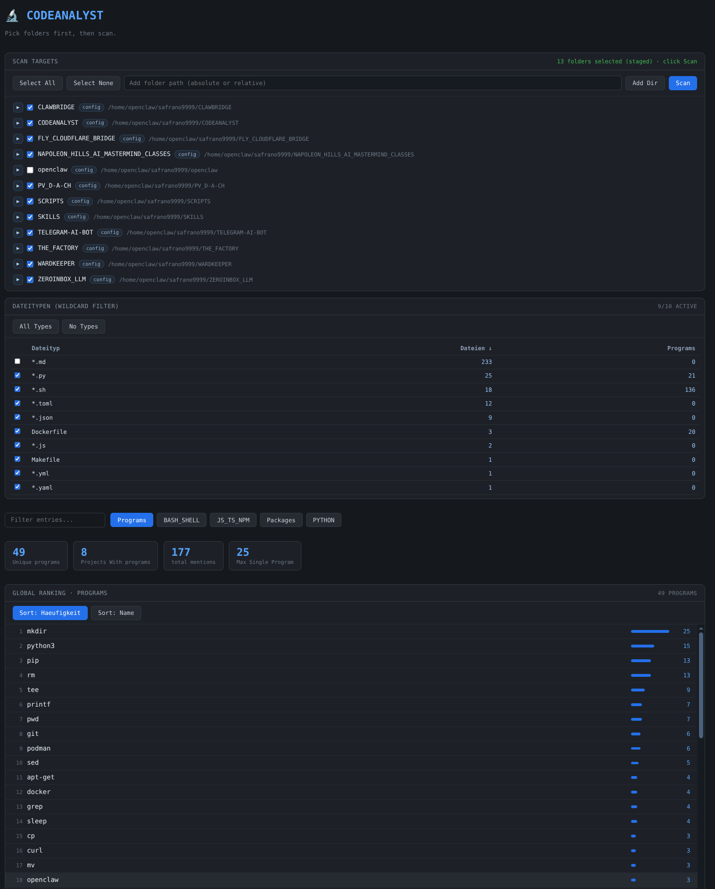

# 🔬 CODEANALYST

Know what your vibe-coded projects are *actually* using. 👀

CODEANALYST scans your codebase and shows which external programs/commands appear most often, so you can review hidden dependencies, risky tooling, and automation behavior before trusting a repo.

## ✨ What You Get

- Program usage ranking (global + per project)
- Syntax/program-function views from dynamic `Listings/`
- Package view for Dockerfile package managers
- Click-to-open source files for each hit
- Live filtering by folders and file types

## 🚀 Quick Deploy (Local)

```bash
git clone https://github.com/safrano9999/CODEANALYST.git
cd CODEANALYST
python3 -m venv venv
./venv/bin/python -m pip install -r requirements.txt
./venv/bin/python app.py
```

Open: `http://127.0.0.1:7720`

No global Python/pip needed: everything runs from `./venv/bin/...` ✅

## ⚙️ Minimal Config

Edit `codeanalyst.conf` and add folders to scan (one path per line), e.g.:

```txt
../
/home/you/projects/MY_REPO
```

## 🧩 Listings

`Listings/` defines dynamic analysis tabs (for example `BASH_SHELL`, `PYTHON`, `JS_TS_NPM`, `Packages`).

Each file can contain:
- tokens (syntax/program-functions)
- wildcard patterns (like `*.sh`, `*.py`, `Dockerfile`)
