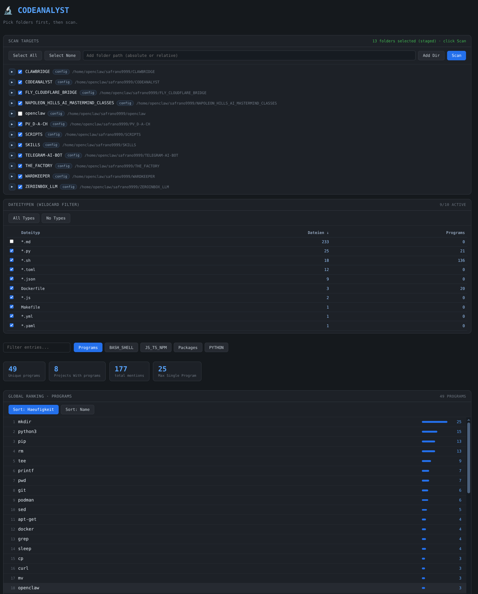

# CODEANALYST

Know what your vibe-coded projects are *actually* using.



CODEANALYST scans your codebase and shows which external programs/commands appear most often, so you can review hidden dependencies, risky tooling, and automation behavior before pushing repo.
Also it helps to understand the mechanics the agents used to deliver.

## What You Get

- Program usage ranking (global + per project)
- Syntax/program-function views from dynamic `Listings/`
- Package view for Dockerfile package managers
- Click-to-open source files for each hit
- Live filtering by folders and file types

## Quick Deploy

```bash
git clone https://github.com/safrano9999/CODEANALYST.git
cd CODEANALYST
cp config.conf_example config.conf
pip install -r requirements.txt
python webui.py
```

## Container

Pre-built image on Docker Hub: `docker.io/safrano9999/codeanalyst:latest`

```bash
docker pull safrano9999/codeanalyst
docker run --rm -d --name codeanalyst -p 11000:11000 safrano9999/codeanalyst
```

To give the container read-only access to the entire host filesystem:

```bash
docker run --rm -d --name codeanalyst -p 11000:11000 -v /:/host:ro safrano9999/codeanalyst
```

The host filesystem will be available under `/host` inside the container.

Base image: `docker.io/safrano9999/python-fastapi:3.13`

The repository includes:
- `Containerfile`
- `docker-compose.yml`
- `codeanalyst.container` (Podman Quadlet)

Start with:

```bash
podman-compose up -d
```

or:

```bash
docker compose up -d
```

## Configuration

Port and host can be configured in `config.conf`; defaults live in `config.conf_example`:

```env
# FastAPI bind address for direct run and published ports
FASTAPI_HOST=127.0.0.1

# CODEANALYST web UI internal port
CODEANALYST_PORT=11000
```

## Listings

Preconfigured for Bash/Shell, Python and JS/TS
